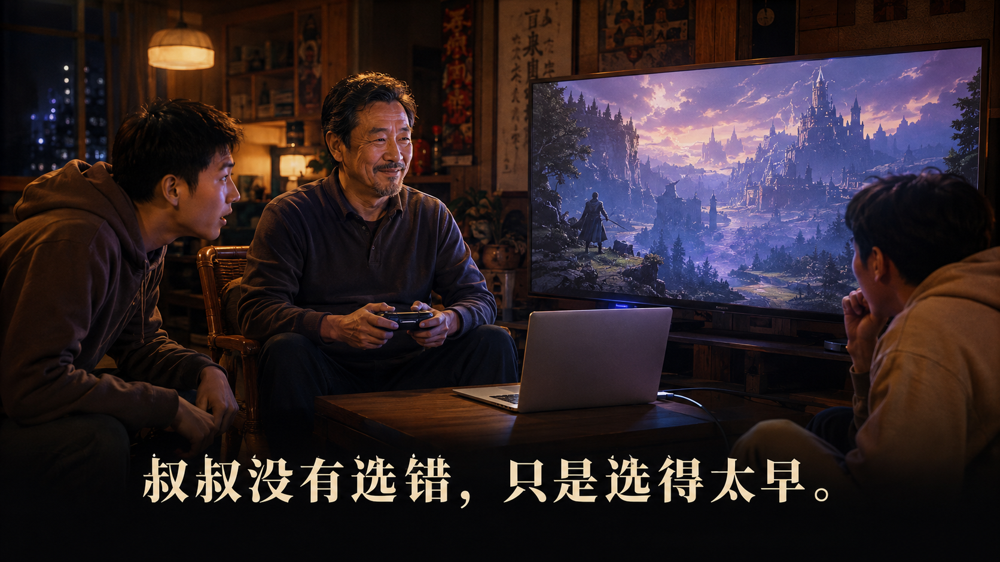
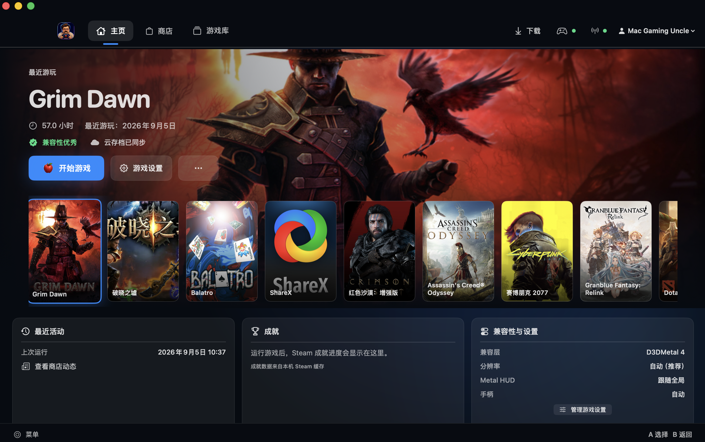
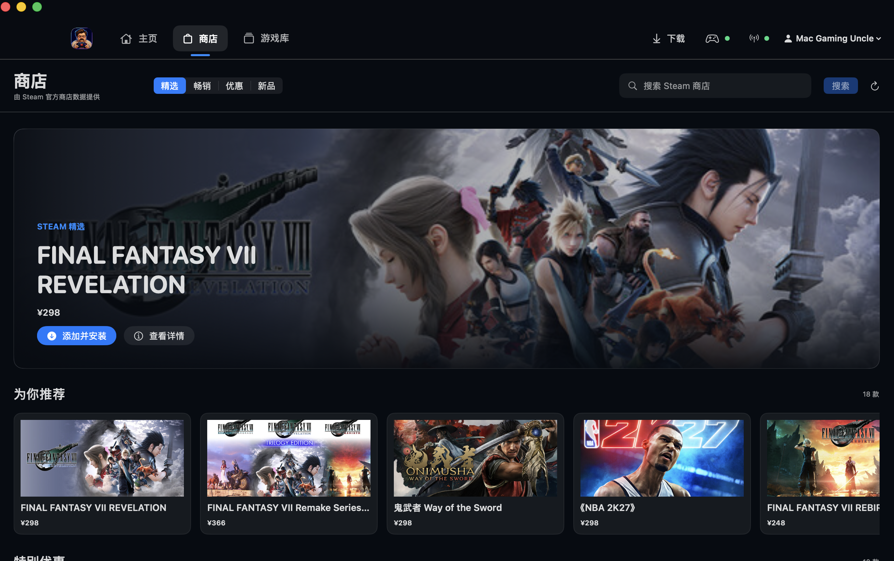
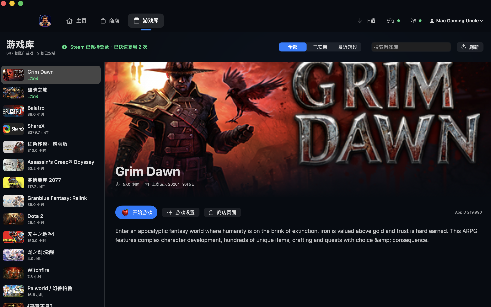
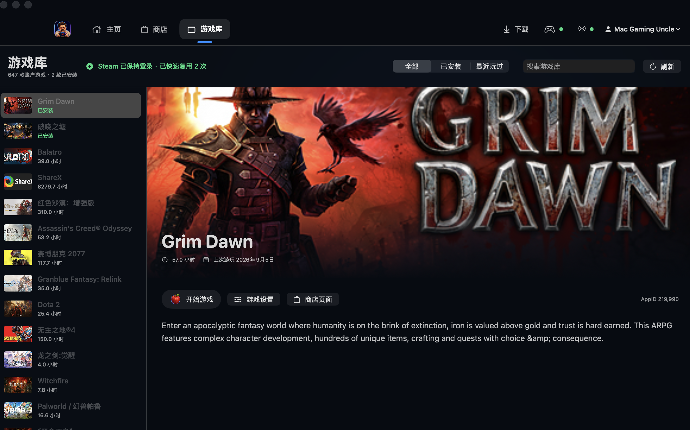
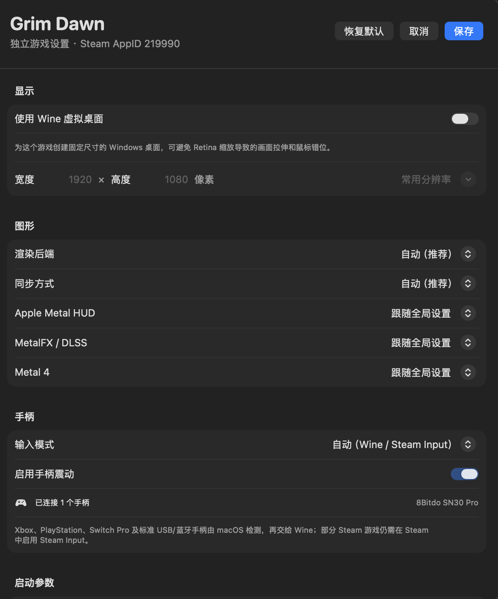
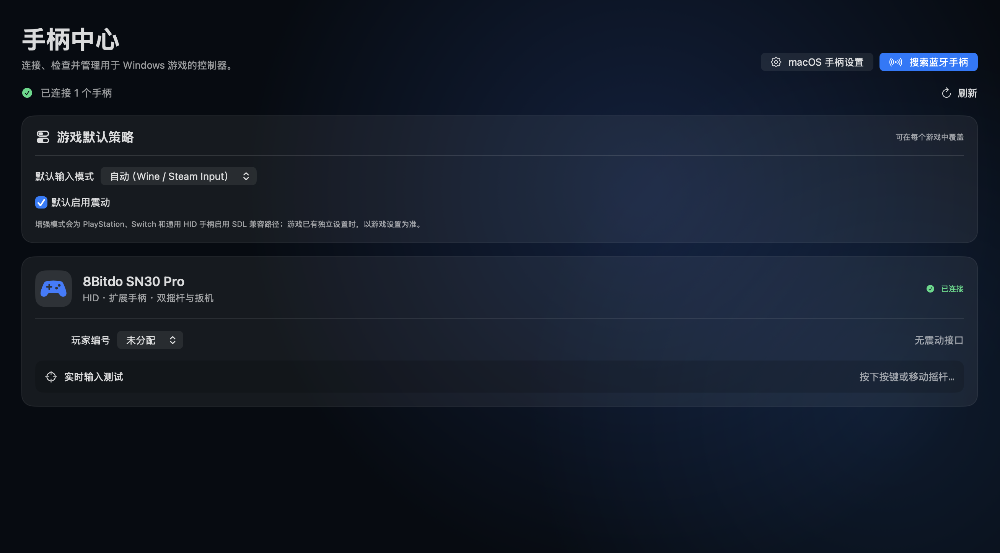

<div align="center">
  
  <h1>Mac Gaming Uncle</h1>
  <p><strong>Run Windows games you own on Apple Silicon Macs.</strong></p>
  <p>Native SwiftUI · Wine · Apple D3DMetal · MetalFX · DXVK</p>
  <p><a href="https://github.com/enginefuture/mac-gaming-uncle/releases/download/v0.2.0/Mac-Gaming-Uncle-0.2.0-macOS-arm64.dmg">Download the 0.2.0 DMG</a> · <a href="https://github.com/enginefuture/mac-gaming-uncle/releases/tag/v0.2.0">Release notes</a></p>
  <p>English · <a href="README.md">简体中文</a></p>
</div>

<p align="center">
  
</p>

> [!IMPORTANT]
> Mac Gaming Uncle is an open-source compatibility research project. It is not a virtual machine and does not include Windows, Steam, games, or Apple D3DMetal. Apple components must be obtained by the user from the official Apple Developer site and imported locally.

## Why this project exists

For years, “gaming on a Mac” was treated as a punchline. We want it to become ordinary and simple: install the app, sign in to Steam, download a game, and press Play. People should not need to learn Wine, bottles, graphics translation, and launch flags before they can enjoy games they already own.

Mac Gaming Uncle's long-term goal is to provide a SteamOS-like experience on the Mac: the system absorbs compatibility complexity while game installation, configuration, updates, and launching become as automatic as possible. It is not a SteamOS port and is not affiliated with Valve; the inspiration is SteamOS's product principle of hiding difficult technology behind a simple experience.

### Permanent noncommercial commitment

The official Mac Gaming Uncle project and its official releases will remain permanently noncommercial: no paid edition, subscriptions, advertising, paid compatibility lists, game commissions, or sale of user data. Compatibility recipes, issue records, and core implementation remain public. Success means helping more Mac users play games they legally own—not generating revenue.

> This commitment governs the official project's operation. The source remains under Apache License 2.0, which permits third-party use and redistribution under its terms; the official project will not use “noncommercial” branding to restrict ordinary open-source collaboration.

## Project status

Mac Gaming Uncle is currently a `0.2.0` research preview for Apple Silicon and macOS 15 or later. It now provides a Steam-client shell, native Store and Library, per-game settings, a reusable global Steam session, and an SDL/XInput controller launch path.

Hardware validation: Apple M3 Max, macOS 26.6.2, GPTK 4.0 beta 2, and Mac Gaming Uncle Wine 11.0.2. `Grim Dawn 1.3.0.8 (x64)` has been validated with its complete Chinese UI, Steam integration, XInput controller support, and Apple's in-game Metal HUD (D3D11, approximately 114 FPS); `Ruins of Dawn` reaches its main menu.

## Screenshots

These screenshots were captured from Mac Gaming Uncle 0.2.0 running on real hardware.

<table>
  <tr>
    <td width="50%"><strong>Home and recently played</strong><br><a href="docs/screenshots/0.2.0/home.png"></a></td>
    <td width="50%"><strong>Native Steam Store</strong><br><a href="docs/screenshots/0.2.0/store.png"></a></td>
  </tr>
  <tr>
    <td width="50%"><strong>Account Library and game details</strong><br><a href="docs/screenshots/0.2.0/library.png"></a></td>
    <td width="50%"><strong>Per-game settings entry</strong><br><a href="docs/screenshots/0.2.0/library-settings-entry.png"></a></td>
  </tr>
  <tr>
    <td width="50%"><strong>Per-game configuration</strong><br><a href="docs/screenshots/0.2.0/per-game-settings.png"></a></td>
    <td width="50%"><strong>Controller Center</strong><br><a href="docs/screenshots/0.2.0/controller-center.png"></a></td>
  </tr>
</table>

## Features

- Native SwiftUI/AppKit interface with a guided Chinese onboarding flow.
- Pixel-game brand art: a tired mustached uncle app icon, a whole-apple controller mark, and a transparent pixel apple for launch buttons, with no bite or play triangle.
- Top-level navigation focuses on Home, Store, and Library; controllers, downloads, and runtime setup remain supporting tools without a separate Community channel.
- A focused Steam-client shell with a native Store home/categories/search experience, account library, artwork, details, install, and launch actions.
- Public Store browsing requires no web login; wishlist, purchase, and account actions open a clearly labeled `store.steampowered.com` secure page without copying Steam CEF's encrypted session cookies.
- Reads AppIDs, playtime, and recent activity from the local Steam `localconfig.vdf` without reading or uploading authentication tokens, and caches official Store metadata locally.
- Downloads the Windows Steam installer from Valve's official CDN.
- Opens Apple's official download page, watches for GPTK 4, and automatically verifies the DMG, SHA-256, and Apple code signature.
- Imports the complete D3DMetal framework, Wine PE bridge, and Unix bridge without redistributing Apple binaries.
- Builds and installs Mac Gaming Uncle Wine 11 from corresponding public source, with GCC 15 MinGW, new WoW64, MSync, SDL2 winebus/XInput, Steam CEF fixes, and a native D3DMetal bridge path.
- Repairs Steam CEF compatibility and installs CJK fonts with DirectWrite font linking.
- Resolves the x64/`*-Win64-Shipping.exe` target, then lets Steam create it through `-applaunch` so SteamAPI, renderer, and HUD state are inherited intact.
- Keeps a global signed-in Steam session and reuses it whenever launch environments are compatible; it restarts only for conflicting renderer, HUD, synchronization, or virtual-desktop settings.
- Installs native D3DMetal PE bridges into the bottle with versioned backups, and automatically repairs the CEF wrapper after a Steam update replaces it.
- Invalidates shader caches when the GPTK version, source hash, MetalFX, DXR, Metal 4, macOS version, or compatibility arguments change.
- Auditable game recipes matched by Steam AppID and executable name.
- Static PE architecture, DirectX import, and anti-cheat inspection; kernel anti-cheat is blocked before launch.
- Apple Metal Performance HUD in the same Mac Gaming Uncle Wine 11 process that runs the game.
- Per-game settings for virtual-desktop resolution, renderer, synchronization, Metal HUD, MetalFX, Metal 4, and launch arguments; settings survive Steam rescans.
- A dedicated Controller Center for Bluetooth discovery, device/battery/capability status, player assignment, live input and rumble tests, plus per-game SDL HIDAPI compatibility.
- SQLite state, isolated Wine bottles, recoverable backups, CLI diagnostics, and automated tests.

## How it works

```text
Windows game
     │
     ├─ Win32 / Win64 APIs ──────────────→ Wine
     ├─ x86_64 instructions ─────────────→ Rosetta 2
     └─ Direct3D 11 / 12 ─→ D3DMetal ───→ Metal
                           └→ DXVK/MoltenVK (fallback)

Steam AppManifest → discovery → game recipe → immutable LaunchPlan → isolated bottle
```

Mac Gaming Uncle composes, verifies, and launches these layers. It does not modify game content or bypass DRM, licensing, or anti-cheat systems.

## Quick start

### Requirements

- Apple Silicon Mac
- macOS 15 or later
- Xcode 26, or a compatible full Swift 6 toolchain
- An Apple Developer login for the initial D3DMetal download
- A Steam account and games you legally own

### Build from source

If you do not need a development environment, download the mount-verified [Mac Gaming Uncle 0.2.0 DMG](https://github.com/enginefuture/mac-gaming-uncle/releases/download/v0.2.0/Mac-Gaming-Uncle-0.2.0-macOS-arm64.dmg) and verify it with the adjacent [SHA-256 file](https://github.com/enginefuture/mac-gaming-uncle/releases/download/v0.2.0/Mac-Gaming-Uncle-0.2.0-macOS-arm64.dmg.sha256).

```bash
git clone https://github.com/enginefuture/mac-gaming-uncle.git
cd mac-gaming-uncle
scripts/build-app.sh
open "dist/Mac Gaming Uncle.app"
```

Build and mount-verify a distributable DMG:

```bash
scripts/build-dmg.sh
```

The current open-source research preview is ad-hoc signed and not notarized. If Gatekeeper blocks a verified GitHub Release download, remove quarantine after reviewing its source:

```bash
xattr -dr com.apple.quarantine "/Applications/Mac Gaming Uncle.app"
```

Development builds are ad-hoc signed. Set a Developer ID for distribution:

```bash
MAC_GAMING_UNCLE_CODESIGN_IDENTITY="Developer ID Application: Your Name (TEAMID)" \
  scripts/build-app.sh
```

### First run

1. Select “Prepare environment” to install Mac Gaming Uncle's reproducibly built open-source Wine 11 runtime.
2. Select “Install GPTK 4.” Mac Gaming Uncle opens the official Apple page. After the user signs in and starts the download, verification and import continue automatically.
3. Select “Install Steam,” complete the Windows Steam installer inside Wine, and sign in.
4. Browse Steam inside Mac Gaming Uncle's Store, then install or launch account games from the native Library.
5. Use the settings button beside a game to configure resolution, HUD, renderer, and controller behavior, then select “Smart launch.” The first graphics-cache build may take several minutes.

MetalFX/DLSS mapping is experimental and disabled by default. It can only help games that already implement DLSS, and recipes can explicitly disable it. `Grim Dawn` does not use DLSS, so Mac Gaming Uncle ignores the global MetalFX toggle for that title to prevent the NVNGX GPU-spoof path from dropping its UI.

“Prefer Metal 4” is enabled by default, but Mac Gaming Uncle first queries the active `MTLDevice` for hardware and OS support. Unsupported systems fall back automatically, and the option can be disabled for a title that regresses. The D3DMetal release, the game's Direct3D API, and the Metal submission path are separate dimensions; a HUD reading `Game Porting Toolkit 4.0b2 · D3D11` is expected.

“Show Apple Metal HUD” relays Apple's HUD environment through Steam to the target game. It does not switch to Apple Evaluation Wine or bypass Steam. The HUD appears only with D3DMetal or DXMT. The `Grim Dawn 1.3` recipe selects the x64 executable and D3DMetal 4, matches the game resolution to the Mac display's logical-point dimensions, and backs up `options.txt` before enabling the classic HUD and native gamepad support. It also disables MSync and Steam Overlay for this title to avoid missing UI and displaced pointer hit regions.

## Development and testing

```bash
swift test
swift build -c release
swift run macgamingunclectl --json doctor
scripts/check.sh
scripts/build-indie-wine11.sh
```

Useful CLI commands:

```text
macgamingunclectl doctor
macgamingunclectl pe <game.exe>
macgamingunclectl steam-scan <steamapps-directory>
macgamingunclectl recipes validate <recipes-directory>
macgamingunclectl gptk import <apple-gptk.dmg|mounted-directory>
macgamingunclectl wine latest
macgamingunclectl wine gaming-install
macgamingunclectl wine local-install <runtime-root>
macgamingunclectl dxvk install <bottle-root>
macgamingunclectl dxmt install
macgamingunclectl steam repair <bottle-root> [wrapper.exe]
macgamingunclectl fonts repair <bottle-root> <runtime-root>
```

Further reading:

- [Architecture](docs/ARCHITECTURE.md)
- [Runtime supply chain](docs/RUNTIME_SUPPLY_CHAIN.md)
- [Testing guide](docs/TESTING.md)
- [Third-party notices](THIRD_PARTY_NOTICES.md)

## Compatibility boundaries

- Wine is a compatibility layer, not a security sandbox. Windows processes still run with the current macOS user's permissions.
- Kernel anti-cheat, Windows drivers, UWP, some DRM systems, and software requiring AVX-512 generally do not work.
- Compatibility for 32-bit titles, D3D9/10/11, launchers, and video playback varies by game.
- D3DMetal, Steam, and games remain subject to their own terms. This repository does not provide those binaries.
- Mac Gaming Uncle is not affiliated with Apple, Valve, CodeWeavers, or any game publisher.

## Contributing

Reproducible compatibility reports, game recipes, tests, and code improvements are welcome. Issues should include the Mac model, macOS version, GPTK/D3DMetal version, Steam AppID, launch arguments, and relevant logs with personal information removed.

Do not submit game files, account credentials, Apple download media, D3DMetal binaries, or material intended to bypass DRM or anti-cheat systems.

## License

Mac Gaming Uncle source code is licensed under the [Apache License 2.0](LICENSE). Third-party components remain under their own licenses or terms; see [THIRD_PARTY_NOTICES.md](THIRD_PARTY_NOTICES.md).
